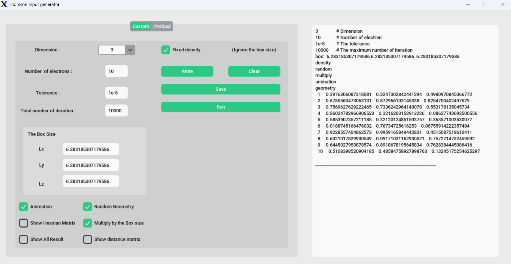

# Thomson
Thomson is program to solve thomson problem in torus in one,two and three dimension based on FORTAN90



# Prerequisite
* compiler (gfortran recommended):

  ```sh
  sudo apt install gfortran
  ```
* library (llapack, openmp):
  
  ```sh
  sudo apt-get install liblapack-dev libopenblas-dev libomp-dev
  ```
* for animation (gnuplot, FFmpeg):

  ```sh
  sudo apt-get install gnuplot ffmpeg
  ```
  
  
# Build

* build the program
  
  ```sh
  make Thomson
  ```
 

* build inputfile generator 

  ```sh
  make Input
  ```

# Run 

* the input file generator

  ```sh
  ./ING "The input file name"
  ```
* using python code

```sh
  python Thomson.py
  ``` 
* thomson

  ```sh
  ./Thomson "The input file name"
  ```
  
* there are some example of the inputfile in the example folder you can use anyone of them or make your input
  
  
<!-- CONTACT -->
## Contact

Stefano Evangelisti - stefano.lcpq@gmail.com

Amer Alrakik - alrakikamer@gmail.com

Project Link: [https://github.com/ALRAKIK/Thomson](https://github.com/ALRAKIK/Thomson)
